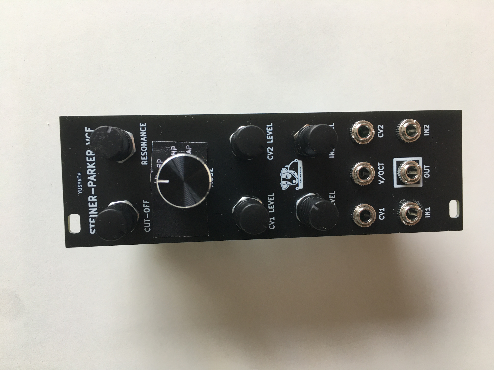
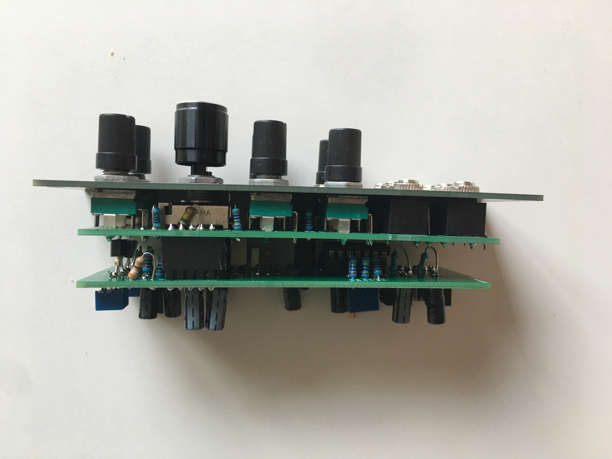
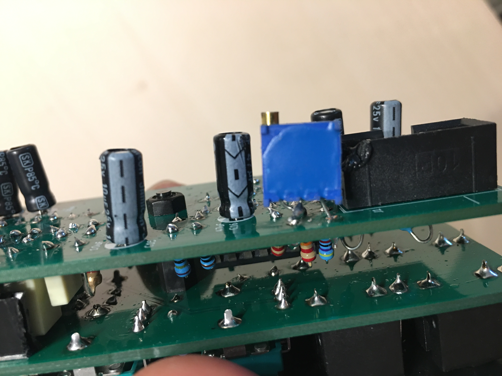

# Yusynth-SteinerParkerVCF
Adaptation du Yusynth [SteinerParkerVCF](http://yusynth.net/Modular/index_en.html) au format Eurorack
Testé et Fonctionnel

J'ai fait une petite erreur sur la sérigraphie du bouton Mode qui se trouvait du mauvais côté du bouton, mais c'est corrigé dans le fichier kicad.
J'ai ajouté un trimmer 100k pour pouvoir régler la résonance.

I made a small mistake on the screen printing of the Mode button which was on the wrong side of the button, but it is corrected in the kicad file.
I added a 100k trimmer to be able to adjust the resonance.
 

Remplacement de la resistance R19 de 3.9K par un trimpot 100K, (souder la 3eme patte sur la patte centrale)
Replacement of the 3.9K resistor R19 with a 100K trimpot, (solder the 3rd pin on the central pin).

[Build document](https://htmlpreview.github.io/?https://github.com/jojo-monk/Yusynth-SteinerParkerVCF/blob/main/ibom.html)

